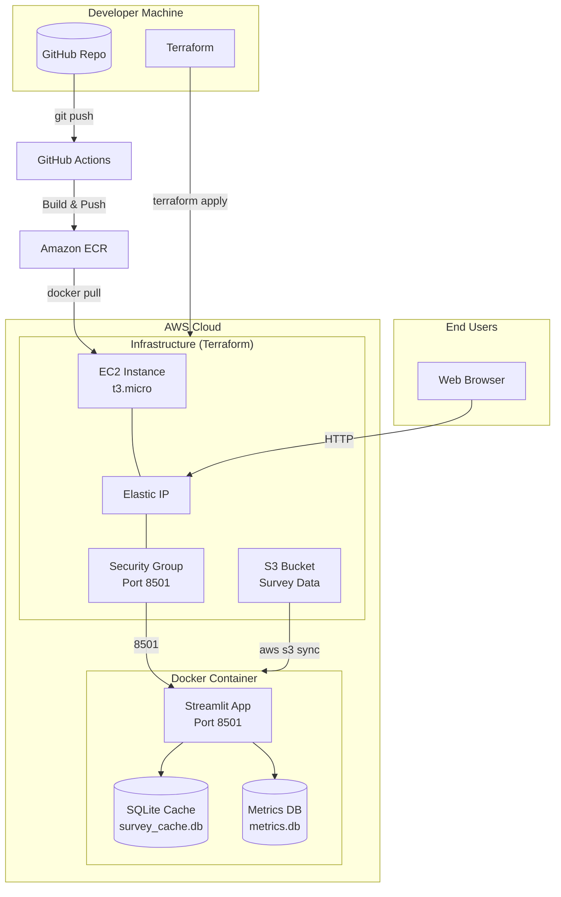
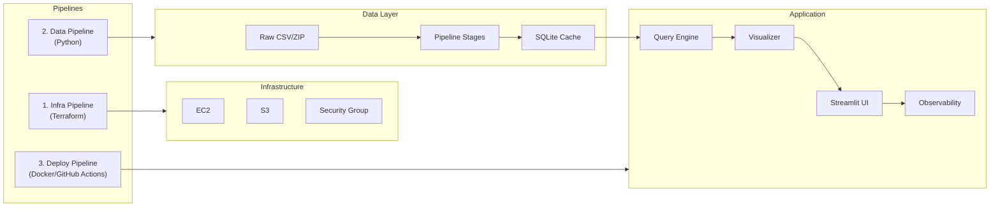
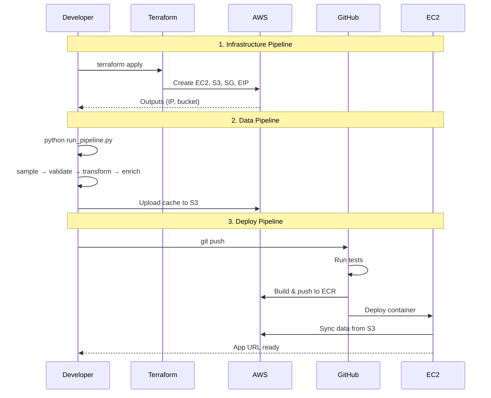
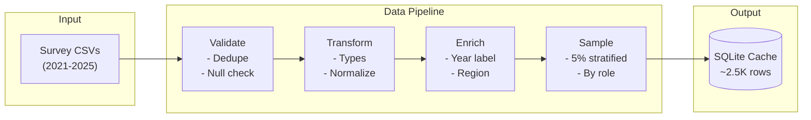
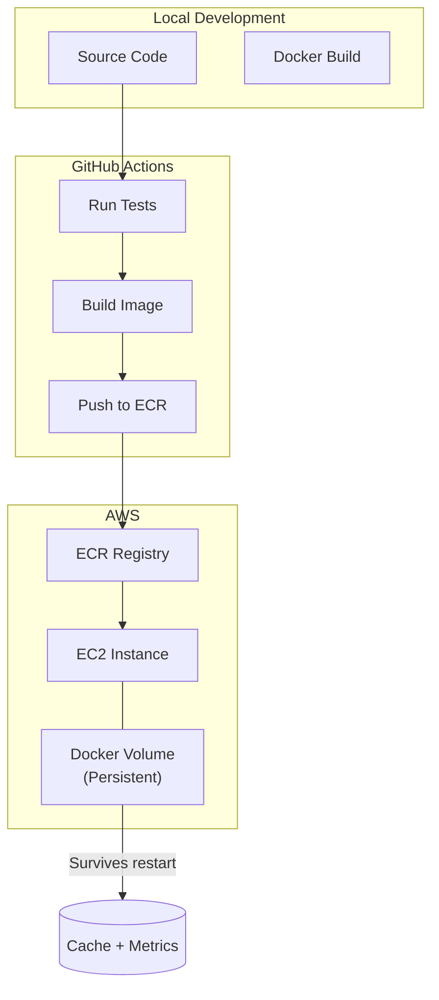
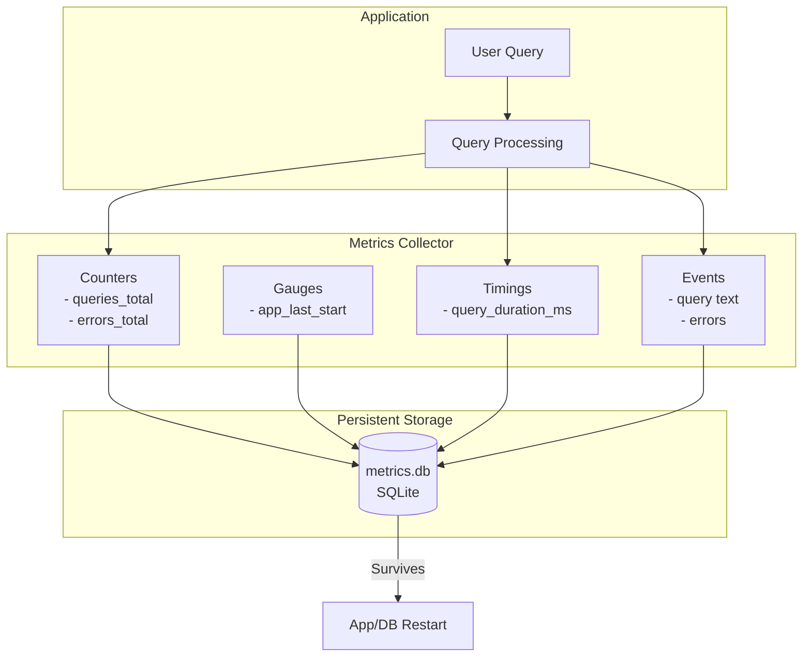
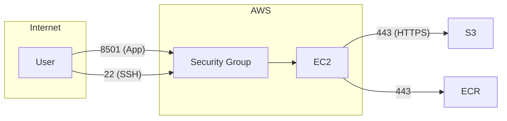

# Architecture

## System Overview

## Component Diagram

## Pipeline Flow

## Data Flow

## Deployment Architecture

## Observability

## Security

## Cost Summary

| Component | Spec | Monthly Cost |
|-----------|------|--------------|
| EC2 | t3.micro | ~$8–10 |
| EBS | 20GB gp3 | ~$2 |
| S3 | < 5GB | < $0.15 |
| Data Transfer | Light | ~$1 |
| **Total** | | **~$12–15/month** |

For 4-day demo: **~$2–3**
