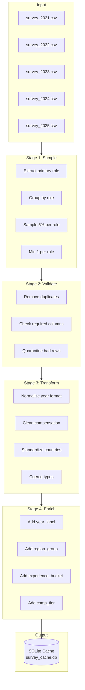
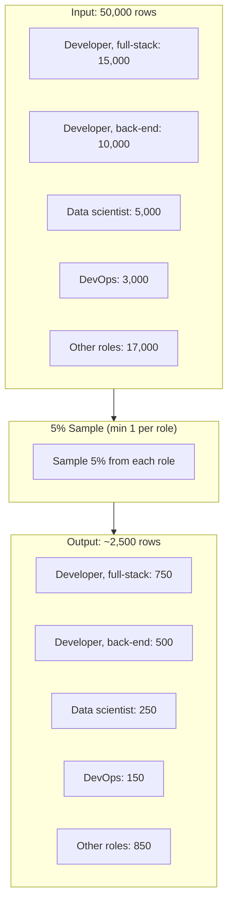
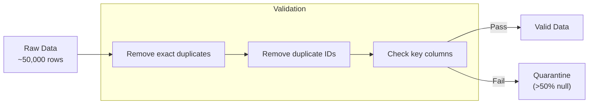
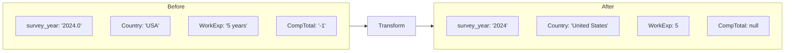
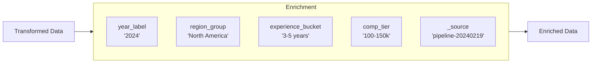
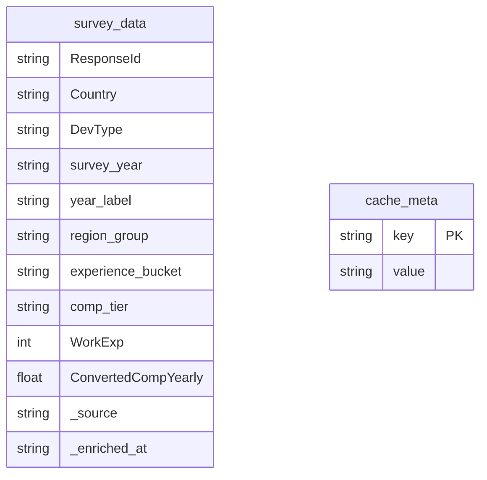

# Data Pipeline Workflow

## Overview

The data pipeline processes survey data through 4 stages. Sampling runs first to reduce volume before resource-intensive validate/transform/enrich stages.

## Pipeline Stages



## Stage Details

### Stage 1: Sample



**Algorithm:**
1. Extract primary role (first role in semicolon-separated DevType)
2. Group rows by primary role
3. For each role: sample `max(1, round(count * 0.05))` rows
4. Combine all sampled rows

**Properties:**
- Runs first to reduce data volume before validate/transform/enrich
- Maintains role proportions (same distribution as original)
- Guarantees at least 1 row per role (min_per_stratum=1)
- Reproducible (fixed random seed=42)
- ~95% reduction in data size

### Stage 2: Validate



**Checks performed:**
- Remove exact duplicate rows
- Remove duplicate ResponseIds (keep first)
- Quarantine rows with >50% nulls in key columns (ResponseId, DevType, survey_year)

### Stage 3: Transform



**Transformations:**
- Normalize year: `"2024.0"` → `"2024"`
- Normalize country: `"USA"` → `"United States"`
- Convert WorkExp to numeric
- Clean compensation: remove negative values and outliers (>$10M)
- Strip whitespace from all string columns

### Stage 4: Enrich



**Fields added:**
| Field | Description | Example |
|-------|-------------|---------|
| `year_label` | Clean year string | `"2024"` |
| `region_group` | Continent from country | `"North America"` |
| `experience_bucket` | Work experience range | `"3-5 years"` |
| `comp_tier` | Compensation bracket | `"100-150k"` |
| `_source` | Pipeline run ID | `"pipeline-20240219_143022"` |
| `_enriched_at` | Timestamp | `"2024-02-19T14:30:22Z"` |

## Output: SQLite Cache



**Cache metadata:**
- `built_at`: ISO timestamp of cache creation
- `source`: Description (e.g., "5.0% stratified sample")
- `years`: Years in the data (e.g., "2021, 2022, 2023, 2024, 2025")

## Running the Pipeline

### Command Line

```bash
# Basic usage
python run_pipeline.py --input /path/to/survey_data

# With options
python run_pipeline.py \
    --input /path/to/survey_data \
    --sample-pct 5 \
    --seed 42

# Skip cache (just run stages)
python run_pipeline.py --input ./data --skip-cache
```

### Output Structure

```
data/
├── cache/
│   └── survey_cache.db      # Final SQLite cache
├── stages/
│   ├── 01_sample/
│   │   ├── output.parquet
│   │   └── stats.json
│   ├── 02_validate/
│   │   ├── output.parquet
│   │   └── stats.json
│   ├── 03_transform/
│   │   ├── output.parquet
│   │   └── stats.json
│   ├── 04_enrich/
│   │   ├── output.parquet
│   │   └── stats.json
│   └── run_20240219_143022.json
```

## Metrics

Pipeline run produces statistics at each stage:

```json
{
  "run_id": "20240219_143022",
  "stages": {
    "load": {"rows": 50000, "files": 5},
    "validate": {"rows_valid": 49500, "rows_quarantined": 500},
    "transform": {"transforms_applied": ["normalized survey_year", "cleaned CompTotal"]},
    "enrich": {"fields_added": ["year_label", "region_group"]},
    "sample": {"rows_in": 49500, "rows_out": 2475, "reduction_pct": 95.0}
  },
  "cache": {"ok": true, "rows": 2475}
}
```
